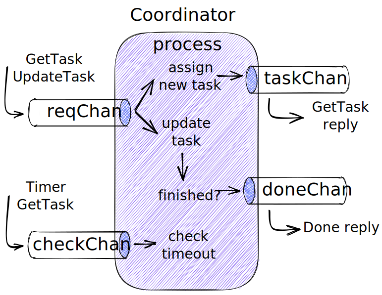

# 6.824 Lab 1 简记

简要记录一下 MIT 6.824 Lab 1 的实现思路。

<!-- truncate -->

## 背景

大数据的处理一度缺乏一种行之有效的范式，直到 2004 年 Google 发表的 [MapReduce] 将函数式编程中经典的 `map` 和 `reduce` 概念引入到了大数据处理领域。这一概念的引入，极大的简化了数据处理的过程，使得各种数据的处理都能以一种统一的方式进行。虽然近二十年过去，大数据的处理经过了长足的发展，但是 MapReduce 仍是我们了解分布式系统的一个重要起点。

在函数式编程中，`map` 和 `reduce` 是两个非常经典的用于处理数组的函数。例如在 JavaScript 和 Rust 中，我们可以用它们来构建新的数组或是进行求和：

**JavaScript**

```js
const array = [1, 2, 3, 4]

const map_res = array.map((x) => x * 2)
console.log(map_res)
// [2, 4, 6, 8]

const reduce_res = array.reduce((acc, x) => acc + x, 0)
console.log(reduce_res)
// 10
```

- [Array.prototype.map()](https://developer.mozilla.org/en-US/docs/Web/JavaScript/Reference/Global_Objects/Array/map)
- [Array.prototype.reduce()](https://developer.mozilla.org/en-US/docs/Web/JavaScript/Reference/Global_Objects/Array/reduce)

**Rust**

```rust
let a = [1, 2, 3, 4];

let map_res = a.iter().map(|x| x * 2).collect::<Vec<i32>>();
println!("{:?}", map_res);
// [2, 4, 6, 8]

let reduce_res = a.iter().fold(0, |acc, x| acc + x);
println!("{}", reduce_res);
// 10
```

- [Iterator::map()](https://doc.rust-lang.org/std/iter/trait.Iterator.html#method.map)
- [Iterator::fold()](https://doc.rust-lang.org/std/iter/trait.Iterator.html#method.fold)

对于更大规模的数据，总可以将待处理的数据构造成 `{Key: Value}` 的形式，然后使用 `map` 和 `reduce` 来处理这些数据。例如，我们可以对一篇文章中的单词出现次数进行统计：

```rust
map(String key, String value):
  // key: document name
  // value: document contents
  for each word w in value:
    EmitIntermediate(w, "1");

reduce(String key, Iterator values):
  // key: a word
  // values: a list of counts
  result = 0
  for each v in values:
    result += ParseInt(v)
  Emit(AsString(result))

// See "MapReduce: Simplified Data Processing on Large Clusters"
```

这个伪代码的功能很简单，先将文章中的单词进行分割，产出一个由若干 `<word> 1` 组成的中间产物，然后对这些中间产物进行聚合得到最终的词频统计结果。

基于这个范式，[MapReduce] 设计了一个分布式执行的框架，其中有一个管理节点（Master）和多个工作节点（Worker）。在整个执行的两个阶段（Map 和 Reduce），Master 将待执行的任务分配给 Worker，Worker 执行完任务后将结果返回给 Master。Master 将所有 Worker 的结果进行汇总，得到最终的结果。


> MapReduce 框架 [(REF)][mapreduce]

## Lab 1

Lab 1 的任务便是在所给框架上实现 Coordinator （即 Master）和 Worker 的功能。2022 版本的实验框架是由 Go 语言编写的，需要用到的 RPC 模板代码已给出，只需学习 Go 语言和 MapReduce 并琢磨清楚框架的逻辑即可。

### 设计思路

首先需要理清楚的是 Coodinator 需要维护哪些信息。显然任务的信息是必须的，包括任务对应的文件、开始时间、状态等。而 Worker 的信息是否需要维护却是个需要探讨的问题。似乎许多 MapReduce 的系统中会由 Coordinator 记录 Worker 的状态、持有的任务等信息，用于进行任务的调度和错误处理。但在 Lab 1 的简单框架中，我认为 Worker 的信息并不需要维护，而是可以按照下图所示的流程进行处理：


1. Coordinator 读取整个任务，将任务分割成若干个 Map 任务，准备分配给 Worker。
2. Worker 通过 `GetTask` 请求任务，Coordinator 从空闲的 Map 任务中分配一个任务给 Worker，并记录任务开始的时间。
3. Coordinator 周期性的检查是否有任务超时，如果有则放回空闲的 Map 任务池中。
4. Worker 执行完毕后，通过 `UpdateTask` 汇报任务结果，Coordinator 将任务从空闲的 Map 任务池中移除，记录用于构建 Reduce 任务的必需信息。
5. 重复 2-4，直到所有 Map 任务完成。
6. Coordinator 根据 Map 阶段的结果，构建 Reduce 任务，准备分配给 Worker。
7. 类似 2-4，Worker 领取任务并执行，Coordinator 检查任务超时并重分配任务。
8. 完成所有 Reduce 任务后，执行必要的工作后可以退出。

考虑到执行任务的 Worker 才能管理自身的状态，Coordinator 记录 Worker 的信息并不是必要的。这有点类似于操作系统中的进程调度，各个核从就绪队列中取出任务执行，而不是由调度器记录每个核的状态。这样设计的好处是 Coordinator 只需维护任务的信息，并等待 Worker 发起请求。而在 Worker 请求并分配任务后，若直到超时都没有收到汇报，便视为 Worker 出了差错，重新分配任务即可。

如果要进一步实现任务中间状态的保存与恢复，对 `UpdateTask` 的功能添加支持或许就可以了。仍然没有什么必要在 Coordinator 处维护 Worker 的信息。

### 实现小结

#### 调试工具

在实验文档的指南中提及了使用 `DPrintf` 来用于调试。但是 Lab 1 的框架中并没有准备这个函数，因此从后续实验的框架中复制过来是一个不错的选择。

不过，如果进一步实现带颜色和分等级的日志输出可能会更好。后续实验可以考虑一下。

#### Worker

在我的设计中，Worker 的结构很简单：在一个循环中不断地请求任务，并根据是 `Map`、`Reduce` 还是 `Exit` 来决定下一步的操作。需要指出的是，有的时候 Worker 请求任务的时候并没有空闲的任务，因此需要等待一段时间。我将这个等待放在了 Coordinator 处，而 Worker 会在 `GetTask` 处阻塞。仔细想来这样设计不太合理，存在 Worker 超时退出后 Coordinator 将新任务发给了已不存在的 Worker 的情况，对整体性能有一定的影响。

#### Coordinator

Coordinator 的实现有两个思路：

1. 一把大锁，所有操作都靠锁完成同步互斥
2. 在一个单独的线程中完成所有数据操作，一切对外接口都和该线程通过 channel 通信

前者的实现可能更简单，不过 Go 语言似乎推崇使用 channel。因此我选择了后者进行实现，大致框架如下图：



Coordinator 的主要处理逻辑都在单独的线程 `process` 中。

1. Coordinator 收到的 `GetTask` 和 `UpdateTask` 都会通过 `reqChan` 告知 `process`，`process` 则在经过处理后将新的任务放入 `taskChan` 用于 `GetTask` 的响应或是更新 `UpdateTask` 传入的任务状态。
2. Coordinator 维护了一个 timer 用于定期检查是否要超时的任务。本来构想的是只需 Worker 请求的时候检查，因此在 `GetTask` 传入的时候也触发这个检查。不过由于我的实现中 `GetTask` 在 Coordinator 处阻塞，因此这个检查的意义就不太大了。
3. 当 `UpdateTask` 触发的任务更新使整个系统的状态从 `Map` 变成 `Reduce` 再变成 `Exit` 后，向 `doneChan` 发送信号，用于最终的退出。

#### 坑

Worker 和 Coordinator 的交互以及各自的状态管理是实现的难点，如果搞错了很容易造成死锁（或是活锁？我没有仔细分析）。然后就会出现测试过不去但还不知道为啥的情况（笑）。

多用 `DPrintf` 打印日志帮助了解自己实现的系统在干什么是很有必要的

## 杂记

这是我第一次碰 Go 语言。在尝试实现 Lab 1 的过程中我总是想写 `.filter()` `.forEach()` 之类的函数，但是 Go 语言却不提供这些函数，需要用 `for` 循环来实现所需的功能。一个标准库里各种网络相关工具都提供的语言却不提供一些基本的方法，这让我很不习惯。而且 Go 的语法和我熟悉的 Rust、JavaScript 有许多“外貌”差别，有种我在使用一种 C++ 方言的感觉。

简单来说，我不是很喜欢 Go。

## 参考

1. [Dayalan, M. (2004). MapReduce: simplified data processing on large clusters. CACM.][mapreduce]
2. [6.824: Distributed Systems][6.824]

[6.824]: https://pdos.csail.mit.edu/6.824/index.html
[mapreduce]: https://api.semanticscholar.org/CorpusID:67055872
