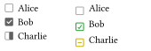
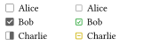

# 在 Typst 的 Cheq 中使用 FontAwesome 图标

在使用 [cheq](https://typst.app/universe/package/cheq) 时想替换默认的图标为 FontAwesome 的图标，发现一些需要注意的地方。

<!-- truncate -->

Cheq 提供的 `checklist` 中包含 `marker-map` 参数，因而最简单的思路便是直接将 FontAwesome 的图标传入 `marker-map` 中：

```typst
#import "@preview/cheq:0.3.0": checklist
#import "@preview/fontawesome:0.6.0": *

#set page(width: 6cm, height: auto, margin: .5em)

#grid(
  columns: (1fr,) * 2
)[
  #show: checklist

  - [ ] Alice
  - [x] Bob
  - [/] Charlie
][
  #show: checklist.with(
    marker-map: (
      "x": fa-square-check(fill: green.darken(20%)),
      " ": fa-square(fill: gray),
      "/": fa-square-minus(fill: yellow.darken(20%)),
    ),
  )

  - [ ] Alice
  - [x] Bob
  - [/] Charlie
]
```

然而这个得到的结果并不理想，FontAwesome 的图标相比于右侧的文字内容显得过于偏下，而左侧 cheq 默认的图标则显得更加居中：



因此，有必要调整 FontAwesome 图标的位置，使其与文字内容更加居中对齐。在 `typst-fontawesome` 中，我允许 `fa-` 函数直接传递 `text` 的参数，从而可以使用 `baseline` 和 `size` 来调整图标的位置与大小使其与 cheq 的默认图标相似：

```typst
#grid(
  columns: (1fr,) * 2
)[
  #show: checklist

  - [ ] Alice
  - [x] Bob
  - [/] Charlie
][
  #show: checklist.with(
    marker-map: (
      "x": fa-square-check(fill: green.darken(20%), baseline: -0.2em, size: .8em),
      " ": fa-square(fill: gray, baseline: -0.2em, size: .8em),
      "/": fa-square-minus(fill: yellow.darken(20%), baseline: -0.2em, size: .8em),
    ),
  )

  - [ ] Alice
  - [x] Bob
  - [/] Charlie
]
```

调整后的结果如下所示：



## 参考

1. [OrangeX4/typst-cheq](https://github.com/OrangeX4/typst-cheq)
2. [duskmoon314/typst-fontawesome](https://github.com/duskmoon314/typst-fontawesome)